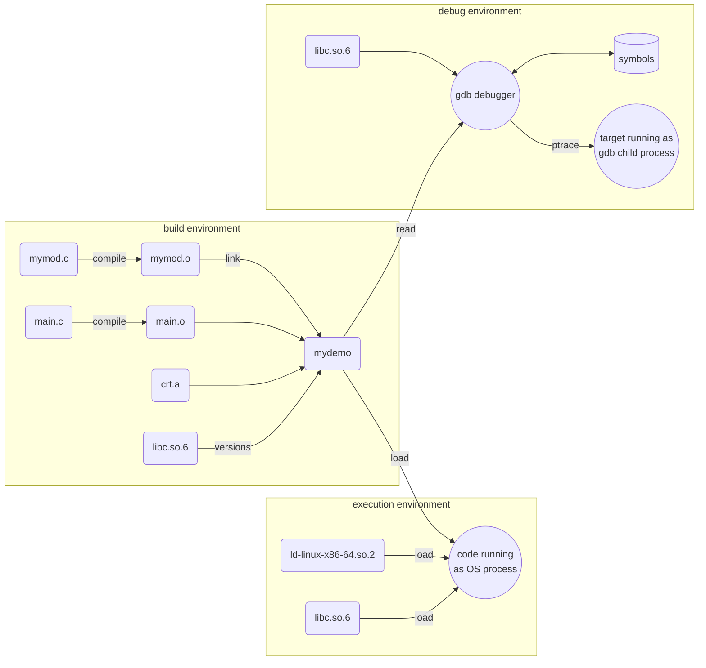
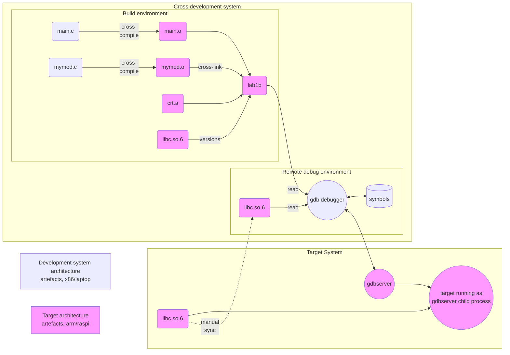

# Cross-Compilation process and libraries


## Key Concepts


| concept | definition
|-----------------|:-------------|
| compiler | Translates source code into machine instructions, outputting an object file. |
| cross-compiler | Translates source code into machine instructions for another (target) architecture |
| architecture | CPU family with specific set of machine instructions, like x86, armv6, mips, ...|
| linker | Merges all object files in project together with necessary static libraries, resulting in executable binary. On command line gcc produces executable a.out by default, that file name is used in some examples below. |
| object file | *.o files: Sequences of compiled machine code that need to be linked to other code to form an executable binary. Object files contain program symbols (for debugging purposes) unless that information has been stripped. | 
| library | An archive of object files (of generally usable compiled program snippets) |
| static library | Link-time option where library code is permanently inserted into final executable. This may result in higher usage on main memory, if the same library has multiple copies in different executables. This also fixes the library version forever (good thing: no future dependency problems, bad thing: library bugs and vulnerabilities will not be fixed automatically with distro upgrades). |
| dynamic library | Link-time option where the link between executable and library is left for loader to be performed at run-time. On Linux systems these are shared objects (.so files), on Windows they are DLL files. | 
| loader | Operation that loads executable binary from mass memory (disk) into main memory (RAM), and loading all necessary shared libraries, and forming a virtual memory map for these. Provided by operating system. |
| GLIBC | GNU collection of C system libraries, the most important of which is libc.so.6 C standard library |
| translation unit | The unit of source code input for the compiler. In C language the compiler processes one C file at a time (with header files that are #included). This means that if your project contains two .c files, then compiler must be invoked two times. |
| gdb | GNU debugger is the most common debug tool for linux systems | 
| debugger | Debugger loads all symbols (variable and function names) from object files and libraries. Debugger can then run the target program (aka debuggee or inferior) as its child process and have full control over the execution of it using ptrace functions and trap (software interrupt) mechanisms, thus enabling breakpoints, single-stepping and inspection of all program variables with symbol names. | 

Sources
[https://opensource.com/article/20/6/linux-libraries]  
[https://eli.thegreenplace.net/2011/01/23/how-debuggers-work-part-1/]  
[https://eli.thegreenplace.net/2011/01/27/how-debuggers-work-part-2-breakpoints]  

## Common Linux tools for (cross-)compilation

| cli tool | properties
|-----------------|:-------------|
| file | Can be run on any file to discover what kind of file it is. Try <br>`file main.c`<br>`file a.out` |
| readelf | Information on binary executable and object files. Can show architecture and symbols in file. <br>`readelf --headers a.out`<br>`readelf --symbols a.out`<br>`readelf -d lab2 \| grep NEEDED` shows what library function versions an executable requires | 
| objdump | Information on binary executable and object files. <br>`objdump -T a.out \| grep -F '*UND*'` shows list of required library functions and GLIBC versions for an executable | 
| ldd | Lists dynamically linked (shared) libraries that an executable requires to be loaded for running.<br>`ldd a.out`<br>`ldd --version` #shows running version of GLIBC |
| strings | Extracts constant strings from a binary file. <br>`strings -a a.out \| grep "GCC: ("` shows with which GCC version the executable was built |
| gcc | GNU C compiler and linker.<br>`gcc main.c`<br>`gcc main.c sub.c -o lab1b` |


## C compilation flow (see graph below)

In this example we assume our project contains two .c source files.
```bash
gcc -g main.c mymod.c -o mydemo
```
1. Each .c file is compiled separately with debug symbols (option -g). Then linker links resulting .o files to C runtime library (which provides entry and exit points for the executable). The resulting executable file has name ´mydemo´.

2. In case of running the code, 
```bash
./mydemo
```
The Linux OS will start the loader, which loads all required shared libraries (see ldd mydemo), links them within process virtual memory map, and runs the application.

3. In case of debugging the code, gdb loads the symbols from mydemo (and all referred shared libraries) and user can run the application (or set breakpoints or study variables etc). Normally you would not use gdb directly from command line, but use it integrated to IDE (eclipse or vscode etc). 
```bash
gdb ./mydemo
...
Reading symbols from mydemo...
(gdb) run
Starting program: /home/kali/lab1b/mydemo
[Thread debugging using libthread_db enabled]
Using host libthread_db library "/lib/x86_64-linux-gnu/libthread_db.so.1".
Hello

[Inferior 1 (process 77563) exited normally]
(gdb)
```




### Cross-compilation flow (see graph below)

Cross-compiled executables cannot be run on development environment (x86 processor does not understand cross-compiled arm instructions; this fact is indicated with color codes in diagram below). Well, actually it would be possible to set up QEMU for arm processor emulation on x86, but here we aim to have a system running on actual hardware with real sensors and actuators, so emulation is not good enough. 

Gdb functionality is divided into two parts, with full gdb running on development system and more limited gdbserver running on target system. Gdb handles everything related to symbols and user interface, and gdbserver does only target control parts.

In this setup we end up having multiple instances of the shared libraries:
- Cross-compiler on development system needs a version of target library to check shared symbol names and library versions. Glibc and gcc versions must be in sync for the toolchain. In lab VM we use gcc 12.1 with glibc 2.28.
- The running code on target system needs access to run-time libraries, and run-time library versions are set by the Linux distro version you are running on target. In lab setup we have Raspbian OS based on debian bullseye, with glibc 2.31. The run-time libarray version should be newer than the build-time library version (Glibc is backwards compatible). 
- Gdb debugger on development system needs to read symbol information from the libraries. These libraries must match target platform libraries. 

Practical consequences as indicated by "manual sync" arrow in graph:
- if you `sudo apt update && sudo apt upgrade` packages, you should the same in debugger environment  
- when you `sudo apt install` new packages (including new libraries) to target system, you should install the libraries to debugger environment too
```bash
pi@rpi0:~ $ sudo apt update
pi@rpi0:~ $ sudo apt upgrade
pi@rpi0:~ $ sudo apt install gpiod

student@student-VirtualBox:~$ sudo sbuild-apt rpizero-bullseye-armhf apt-get update
student@student-VirtualBox:~$ sudo sbuild-apt rpizero-bullseye-armhf apt-get upgrade
student@student-VirtualBox:~$ sudo sbuild-apt rpizero-bullseye-armhf apt-get install gpiod
```





